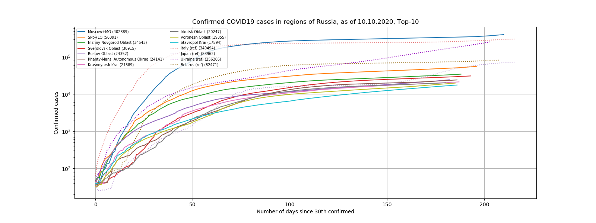

# COVID-19 Data Repository by the Center for Systems Science and Engineering (CSSE) at Johns Hopkins University

### Goals

1. Provide COVID19 dataset containing detailed information on Russia.
2. Maintain CSSE compatibility
3. Provide some higher level APIs for accessing the data.
4. Close the project after a more systematic approch is developed

* [Upstream issue](https://github.com/CSSEGISandData/COVID-19/issues/1262)
* [Generic local discussion (if any)](https://github.com/grwlf/COVID-19_plus_Russia/issues/1)

_Disclamer: the author doesn't have relationships with any official or
commercial organisations. The data provided there are collected from unreliable
sources and may not be accurate. Please use it at your own risk._

### Contents

* `csse_covid_19_data` contains CSV files which were released by CSSE and later
  amended by us. Files released after March 25 contain additional information on
  55 regions of Russia.
* [python3](./python3) folder contains stub and development tools:
  - `covid19ru.check` module for checking certain invariants
  - `covid19ru.fetch` Yandex data fetcher

### Data

#### Visualization



#### Data source description

* https://github.com/CSSEGISandData/COVID-19
  - Upstream world data by CSSE.
* [Rospotrebnadzor](https://www.rospotrebnadzor.ru/about/info/news/)
  - The supposedly original official data source of COVID19 data in Russia.
    Data is published in Russian as a plain text. The source provides daily
    difference per region and current total for the whole state. Example:
    <https://www.rospotrebnadzor.ru/about/info/news/news_details.php?ELEMENT_ID=14125>
* [Yandex COVID19 map](https://yandex.ru/maps/covid19)
  - The Yandex company provides current per-region numbers.
* [NovelCoronaVirusChannel at Telegram](https://t.me/NovelCoronaVirusChannel)
  - Random COVID19 news in Russian.
* <https://стопкоронавирус.рф//#>


#### Update procedure

Originally, author filled the data on Moscow and Saint Petersburg manually,
based on `Rospotrebnadzor` and `NovelCoronaVirusChannel` data. Starting from
March, 25 we follow the below procedure:

1. Fetch hourly data from `Yandex COVID map`
    - Fetching is done by running `monitor` function of the [fetcher
      script](./python3/src/covid19ru/fetch.py)
    - The data is saved into `pending` folder, stamped with UTC time.
2. Fetch daily upstream updates by using regular `git fetch` manually.
3. If update is available,
    1. Rebase repository to `upstream/master` branch using `git rebase`
    2. For every `csse_covid_19_data/csse_covid_19_daily_reports` file which doesn't
       have russian details, do the following:
        1. Determine the update time of 'Russia' record found in the world data.
           The time is supposed to be UTC. The update time is often near `23:30`
           (supposedly UTC time).
        2. Find the russian details dump in `pending` folder which has the
           closest UTC timestamp.
        3. Update world information file by inserting russian details manually.
        4. Review the format compatibility (CSV fields order, date format, etc.).
        5. Run the [checker script](./python3/src/covid19ru/check.py).
        6. Commit the changes to this repository.

#### Related repos

* https://github.com/AlexxIT/YandexCOVID
* https://github.com/klevin92/covid19_moscow_cases
* https://github.com/wolfxyx/moscow-covid-19

Visualizations:

* https://github.com/AaronWard/covid-19-analysis

### Roadmap

* Python code to check the correctness of CSV files
  - ~~Python stub checking the validity of basic CSV structure~~ (see
    [./python3/src/covid19ru/check.py](./python3/src/covid19ru/check.py) )
  - Check less-trivial invariants
* Python API to access the CSV data. It should handle the CSV format change
  which happened around 23.03.2020
  - ~~Pandas API~~ (see [./python3/src/covid19ru/access.py](./python3/src/covid19ru/access.py))
  - ~~Provide compatibility level for data before 23.03.2020~~
  - ???
* Semi-automated data loader from Yandex. Ideally, we want to perform the
  following actions:
  - ~~Collect `Confirmed/Death/Recovered` info for each Russian city~~ (starting
    from `03-25-2020.csv`)
  - ~~Save this information in a temporary file to handle update gap~~
  - ~~Set correct value of Longitude/Latitude for Russian regions~~
  - Figure out what does 'Active' field mean and how to get it.
    * Seems that it is just `Confirmed-Deaths-Recovered`. One have to update the
      data which miss this value.
  - Daily update CSSE with Russian state information
* Find data on Russian regions for pre- 25.03.2020 period.

### Log

#### 30.03.2020

* Number of 'recovered' decreased in Sverdlovsk oblast

#### 25.03.2020

* Conflict resolved. `23-22-2020.csv` file seemed to be damaged by the upstream admins.
* <https://github.com/CSSEGISandData/COVID-19/issues/1523>
* Implemented Yandex data fetcher

#### 23.03.2020

Upstream format change: now

* `,,Moscow,Russia,2020-03-24 00:00:00,55.75222,37.61556,262,1,9,,"Moscow, Russia"`
* `,,"Saint Petersburg",Russia,2020-03-22 00:00:00,59.93863,30.31413,16,0,2,,"Saint Petersburg, Russia"`

#### 21.03.2020

We augmented CSV files from `csse_covid_19_daily_reports` folder by adding lines
like:

* `Moscow,Russia,2020-03-21T00:00:00,5,0,0,55.75222,37.61556`
* `"Saint Petersburg",Russia,2020-03-21T00:00:00,4,0,2,59.93863,30.31413`

**Original README.md starts here**

# 2019 Novel Coronavirus COVID-19 (2019-nCoV) Data Repository by Johns Hopkins CSSE


This is the data repository for the 2019 Novel Coronavirus Visual Dashboard operated by the Johns Hopkins University Center for Systems Science and Engineering (JHU CSSE). Also, Supported by ESRI Living Atlas Team and the Johns Hopkins University Applied Physics Lab (JHU APL).


<b>Visual Dashboard (desktop):</b>
https://www.arcgis.com/apps/opsdashboard/index.html#/bda7594740fd40299423467b48e9ecf6

<b>Visual Dashboard (mobile):</b>
http://www.arcgis.com/apps/opsdashboard/index.html#/85320e2ea5424dfaaa75ae62e5c06e61

<b>Please cite our Lancet Article for any use of this data in a publication:</b>
[An interactive web-based dashboard to track COVID-19 in real time](https://doi.org/10.1016/S1473-3099(20)30120-1)

<b>Provided by Johns Hopkins University Center for Systems Science and Engineering (JHU CSSE):</b>
https://systems.jhu.edu/

<b>DONATE to the CSSE dashboard team:</b> https://engineering.jhu.edu/covid-19/support-the-csse-covid-19-dashboard-team/


<b>DATA SOURCES:</b>
This list includes a complete list of all sources ever used in the data set, since January 21, 2010. Some sources listed here (e.g., WHO, ECDC, US CDC, BNO News) are not currently relied upon as a source of data.

- Aggregated data sources:
  - World Health Organization (WHO): https://www.who.int/
  - European Centre for Disease Prevention and Control (ECDC): https://www.ecdc.europa.eu/en/geographical-distribution-2019-ncov-cases 
  - DXY.cn. Pneumonia. 2020. http://3g.dxy.cn/newh5/view/pneumonia
  - US CDC: https://www.cdc.gov/coronavirus/2019-ncov/index.html
  - BNO News: https://bnonews.com/index.php/2020/02/the-latest-coronavirus-cases/
  - WorldoMeters: https://www.worldometers.info/coronavirus/  
  - 1Point3Arces: https://coronavirus.1point3acres.com/en  
  - COVID Tracking Project: https://covidtracking.com/data. (US Testing and Hospitalization Data. We use the maximum reported value from "Currently" and "Cumulative" Hospitalized for our hospitalization number reported for each state.)
  - Los Angeles Times: https://www.latimes.com/projects/california-coronavirus-cases-tracking-outbreak/
  - The Mercury News: https://www.mercurynews.com/tag/coronavirus/

- US data sources at the state (Admin1) or county/city (Admin2) level:  
  - Washington State Department of Health: https://www.doh.wa.gov/emergencies/coronavirus
  - Maryland Department of Health: https://coronavirus.maryland.gov/
  - New York State Department of Health: https://health.data.ny.gov/Health/New-York-State-Statewide-COVID-19-Testing/xdss-u53e/data
  - New York City Health Department: https://www1.nyc.gov/site/doh/covid/covid-19-data.page
  - NYC Department of Health and Mental Hygiene: https://www1.nyc.gov/site/doh/covid/covid-19-data.page and https://github.com/nychealth/coronavirus-data
  - Florida Department of Health Dashboard: https://services1.arcgis.com/CY1LXxl9zlJeBuRZ/arcgis/rest/services/Florida_COVID19_Cases/FeatureServer/0
    and https://fdoh.maps.arcgis.com/apps/opsdashboard/index.html#/8d0de33f260d444c852a615dc7837c86
  - Colorado: https://covid19.colorado.gov/covid-19-data
  - Virginia: https://www.vdh.virginia.gov/coronavirus/
  - Northern Mariana Islands CNMI Department of Public Health: https://cnmichcc.maps.arcgis.com/apps/opsdashboard/index.html#/4061b674fc964efe84f7774b7979d2b5
  - Missouri Department of Health: https://www.arcgis.com/apps/MapSeries/index.html?appid=8e01a5d8d8bd4b4f85add006f9e14a9d
  - Missouri: Nodaway County: https://www.nodawaypublichealth.org/
  - St. Louis City Department of Health: https://www.stlouis-mo.gov/covid-19/data/#totalsByDate
  - St. Louis County: https://stlcorona.com/resources/covid-19-statistics1/
  - Massachusetts: https://www.mass.gov/info-details/covid-19-response-reporting
  - Michigan: https://www.michigan.gov/coronavirus/0,9753,7-406-98163_98173---,00.html 
  - Illinois Department of Public Health: https://dph.illinois.gov/covid19
  - Indiana State Department of Health: https://hub.mph.in.gov/dataset?q=COVID
  - Connecticut Department of Public Health: https://data.ct.gov/stories/s/COVID-19-data/wa3g-tfvc/
  - Ohio Department of Health: https://coronavirus.ohio.gov/wps/portal/gov/covid-19/home
  - Oregon Office of Emergency Management: https://experience.arcgis.com/experience/fff9f83827c5461583cd014fdf4587de
  - Tennessee Department of Health: https://www.tn.gov/health/cedep/ncov.html
  - Rhode Island Department of Health: https://ri-department-of-health-covid-19-data-rihealth.hub.arcgis.com/
  - Wisconsin Department of Health Services: https://www.dhs.wisconsin.gov/covid-19/data.htm
  - North Carolina City of Greenville GIS: https://www.arcgis.com/apps/opsdashboard/index.html#/7aeac695cafa4065ba1505b1cfa72747
  - Iowa State Government: https://coronavirus.iowa.gov/
  - Minnesota Department of Health: https://www.health.state.mn.us/diseases/coronavirus/situation.html
  - Alabama Public Health: https://www.alabamapublichealth.gov/covid19/
  - Mississippi State Department of Health: https://msdh.ms.gov/msdhsite/_static/14,0,420.html
  - Nebraska Department of Health and Human Services: https://experience.arcgis.com/experience/ece0db09da4d4ca68252c3967aa1e9dd
  - South Carolina Department of Health and Environmental Control: https://scdhec.gov/infectious-diseases/viruses/coronavirus-disease-2019-covid-19/sc-testing-data-projections-covid-19
  - Nevada Department of Health and Human Services: https://nvhealthresponse.nv.gov/
  - New Jersey Department of Health: https://covid19.nj.gov/
  - Delaware Emergency Management Agency: https://coronavirus.delaware.gov/
  - Utah Department of Health: https://coronavirus-dashboard.utah.gov/#overview
  - Arizona Emergency Support Function (ESF)/Recovery Support Function (RSF) Operations Dashboard: https://www.arcgis.com/apps/MapSeries/index.html?appid=62e6bfa682a34e6aae9d9255ac865467
  - Departamento de Salud, Puerto Rico: https://bioseguridad.maps.arcgis.com/apps/opsdashboard/index.html#/d7308c1abb4747e584329adf1215125e
  - Arkansas Department of Health: https://experience.arcgis.com/experience/c2ef4a4fcbe5458fbf2e48a21e4fece9
  - Maine Department of Health and Human Services: https://www.maine.gov/dhhs/mecdc/infectious-disease/epi/airborne/coronavirus/data.shtml
  - Pennsylvania Department of Health: https://www.health.pa.gov/topics/disease/coronavirus/Pages/Cases.aspx
  - City of Philadelphia: https://www.phila.gov/programs/coronavirus-disease-2019-covid-19/
  - Lancaster County: https://covid-19-lancastercountypa.hub.arcgis.com/
  - Chester County: https://chesco.maps.arcgis.com/apps/opsdashboard/index.html#/975082d579454c3ca7877db0a44e61ca
  - Louisiana Department of Health: http://ldh.la.gov/coronavirus/
  - Government of The District of Columbia: https://coronavirus.dc.gov/page/coronavirus-data 
  - North Dakota Department of Health: https://www.health.nd.gov/diseases-conditions/coronavirus/north-dakota-coronavirus-cases
  - Oklahoma State Department of Health: https://looker-dashboards.ok.gov/embed/dashboards/44
  - Guam Department of Public Health and Social Services: http://dphss.guam.gov/covid-19/ 
  - New Mexico Department of Health: https://cvprovider.nmhealth.org/public-dashboard.html
  - Kentucky Department of Public Health: https://kygeonet.maps.arcgis.com/apps/opsdashboard/index.html#/543ac64bc40445918cf8bc34dc40e334
  - Georgia Department of Public Health: https://dph.georgia.gov/covid-19-daily-status-report
  - State of Hawai'i Department of Health: https://health.hawaii.gov/coronavirusdisease2019/what-you-should-know/current-situation-in-hawaii/
  - Reno County Health Department: http://reno.maps.arcgis.com/apps/opsdashboard/index.html#/dfaef27aede1414b89abf393b2ccb994
  - Texas Department of State Health Services: https://dshs.texas.gov/coronavirus/
  - Texas: City of San Antonio: https://covid19.sanantonio.gov/Home
  - Texas: Brazioria County: https://www.brazoriacountytx.gov/departments/health-department/brazoria-county-coronavirus-map
  - Texas: Brazos County Health District: http://www.brazoshealth.org
  - Texas: Cameron County Public Health: https://www.cameroncounty.us/publichealth/index.php/coronavirus/
  - Texas: Collin County: https://www.collincountytx.gov/healthcare_services/Pages/news.aspx
  - Texas: Dallas County: https://www.dallascounty.org/departments/dchhs/2019-novel-coronavirus.php
  - Texas: Denton County: https://gis-covid19-dentoncounty.hub.arcgis.com/pages/covid-19cases
  - Texas: Ector County:  http://www.co.ector.tx.us/page/ector.CoronavirusCOVID19
  - Texas: City of El Paso: http://epstrong.org/results.php
  - Texas: Fayette County: https://www.co.fayette.tx.us/
  - Texas: Fort Bend County Health & Human Services: https://www.fbchealth.org/ncov/
  - Texas: Galveston County Health District: https://www.gchd.org/about-us/news-and-events/coronavirus-disease-2019-covid-19/galveston-county-confirmed-covid-19-cases
  - Texas: Harris County: https://publichealth.harriscountytx.gov/Resources/2019-Novel-Coronavirus
  - Texas: Hays County: https://hayscountytx.com/covid-19-information-for-hays-county-residents/
  - Texas: Hidalgo County Health and Human Services: https://www.hidalgocounty.us/2630/Coronavirus-Updates
  - Texas: Midland County: https://www.midlandtexas.gov/955/Coronavirus-COVID-19
  - Texas: Montgomery County: https://coronavirus-response-moco.hub.arcgis.com/
  - Texas: City of Corpus Christi: https://www.cctexas.com/coronavirus
  - Texas: Amarillo Public Health Department: https://covid-data-amarillo.hub.arcgis.com/
  - Texas: Tarrant County Public Health: https://www.tarrantcounty.com/en/public-health/disease-control---prevention/coronaviruas.html
  - Texas: City of Mount Pleasant: https://www.mpcity.net/632/COVID-19-UPDATES
  - Texas: City of San Angelo: https://www.cosatx.us/departments-services/health-services/coronavirus-covid-19#ad-image-0
  - Texas: San Angelo Standard-Times: https://www.gosanangelo.com/
  - Texas: Travis County: https://www.traviscountytx.gov/news/2020/1945-novel-coronavirus-covid-19-information
  - Texas: City of Laredo: https://www.cityoflaredo.com/coronavirus/
  - Texas: Williamson County & Cities Health District: http://www.wcchd.org/COVID-19/dashboard.php
  - California Department of Publich Health: https://www.cdph.ca.gov/covid19
  - California: Mariposa County: https://www.mariposacounty.org/1592/COVID-19-Information
  - California: Alameda County Public Health Department: https://covid-19.acgov.org/
  - California: Fresno County Public Health Department: https://www.co.fresno.ca.us/departments/public-health/covid-19
  - California: Humboldt County: https://humboldtgov.org/
  - California: Madera County: https://www.maderacounty.com/government/public-health/corona-virus-covid-19/covid-revised
  - California: Marin County Health & Human Services: https://coronavirus.marinhhs.org/
  - California: Orange County Health Care Agency: https://occovid19.ochealthinfo.com/coronavirus-in-oc
  - California: Placer County: https://www.placer.ca.gov/coronavirus
  - California: Riverside County: https://www.rivcoph.org/coronavirus
  - California: Sacramento County: https://www.saccounty.net/COVID-19/
  - California: San Francisco Department of Public Helath: https://www.sfdph.org/dph/alerts/coronavirus.asp
  - California: San Benito County Health & Human Services: https://hhsa.cosb.us/publichealth/communicable-disease/coronavirus/
  - California: San Joaquin County Public Health Services: http://www.sjcphs.org/coronavirus.aspx
  - California: San Mateo County: https://www.smchealth.org/coronavirus
  - California: Santa Cruz County Health Services Agency: http://www.santacruzhealth.org/HSAHome/HSADivisions/PublicHealth/CommunicableDiseaseControl/CoronavirusHome.aspx
  - California: Shasta County: https://www.co.shasta.ca.us/covid-19/overview
  - California: Solano County: https://www.co.shasta.ca.us/covid-19/overview
  - California: Sonoma County: https://socoemergency.org/emergency/novel-coronavirus/coronavirus-cases/
  - California: Stanislaus County Health Services Agency: http://schsa.org/publichealth/pages/corona-virus/
  - California: Ventura County: https://www.venturacountyrecovers.org/
  - California: Yolo County: https://www.yolocounty.org/health-human-services/adults/communicable-disease-investigation-and-control/novel-coronavirus-2019/
  - California: Los Angeles County: http://publichealth.lacounty.gov/media/coronavirus/
  - California: San Diego County: https://www.sandiegocounty.gov/coronavirus.html
  - California: Santa Clara County: https://www.sccgov.org/sites/covid19/
  - California: Imperial County Public Health Department: http://www.icphd.org/health-information-and-resources/healthy-facts/covid-19/
  - California: San Bernardino County: https://sbcovid19.com/
  - Montana Department of Public Health and Human Services: https://dphhs.mt.gov/publichealth/cdepi/diseases/coronavirusmt
  - South Dakota Department of Health: https://doh.sd.gov/news/coronavirus.aspx
  - Wyoming Department of Health: https://health.wyo.gov/publichealth/infectious-disease-epidemiology-unit/disease/novel-coronavirus/
  - New Hampshire Department of Health and Human Services: https://www.nh.gov/covid19/dashboard/summary.htm
  - Idaho Government: https://coronavirus.idaho.gov/
  - Virgin Islands Department of Health: https://www.covid19usvi.com/
  - Vermont Department of Health: https://www.healthvermont.gov/response/coronavirus-covid-19/current-activity-vermont
  - Kansas: Reno County Health Department: https://experience.arcgis.com/experience/9a7d44773e4c4a48b3e09e4d8673961b/page/page_18/
  - Kansas: Kansas Department Of Health And Environment: https://www.coronavirus.kdheks.gov/160/COVID-19-in-Kansas

  
- Non-US data sources at the country/region (Admin0) or state/province (Admin1) level:
  - National Health Commission of the People’s Republic of China (NHC):
    http://www.nhc.gov.cn/xcs/yqtb/list_gzbd.shtml
  - China CDC (CCDC): http://weekly.chinacdc.cn/news/TrackingtheEpidemic.htm
  - Hong Kong Department of Health: https://www.chp.gov.hk/en/features/102465.html
  - Macau Government: https://www.ssm.gov.mo/portal/
  - Taiwan CDC: https://sites.google.com/cdc.gov.tw/2019ncov/taiwan?authuser=0
  - Government of Canada: https://www.canada.ca/en/public-health/services/diseases/coronavirus.html
  - Australia Government Department of Health: https://www.health.gov.au/news/coronavirus-update-at-a-glance
  - COVID Live (Australia): https://www.covidlive.com.au/
  - Ministry of Health Singapore (MOH): https://www.moh.gov.sg/covid-19
  - Italy Ministry of Health: http://www.salute.gov.it/nuovocoronavirus
  - Dati COVID-19 Italia (Italy): https://github.com/pcm-dpc/COVID-19/tree/master/dati-regioni
  - French Government: https://dashboard.covid19.data.gouv.fr/ and https://github.com/opencovid19-fr/data/blob/master/dist/chiffres-cles.json
  - OpenCOVID19 France: https://github.com/opencovid19-fr
  - Palestine (West Bank and Gaza): https://corona.ps/details
  - Israel: https://govextra.gov.il/ministry-of-health/corona/corona-virus/
  - National Institute of Health of Kosovo: https://corona-ks.info/?lang=en and https://raw.githubusercontent.com/bgeVam/Kosovo-Coronatracker-Data/master/data.json
  - Berliner Morgenpost (Germany): https://interaktiv.morgenpost.de/corona-virus-karte-infektionen-deutschland-weltweit/
  - rtve (Spain): https://www.rtve.es/noticias/20200514/mapa-del-coronavirus-espana/2004681.shtml
  - Ministry of Health, Republic of Serbia: https://covid19.rs/homepage-english/ 
  - Chile: https://www.minsal.cl/nuevo-coronavirus-2019-ncov/casos-confirmados-en-chile-covid-19/
  - Chile: https://www.gob.cl/coronavirus/cifrasoficiales/
  - Brazil Ministry of Health: https://covid.saude.gov.br/
  - Brazil: https://github.com/wcota/covid19br. Data described in [DOI: 10.1590/SciELOPreprints.362](https://doi.org/10.1590/SciELOPreprints.362)
  - Gobierono De Mexico:https://covid19.sinave.gob.mx/
  - Japan COVID-19 Coronavirus Tracker: https://covid19japan.com/#all-prefectures
  - Monitoreo del COVID-19 en Perú -  Policía Nacional del Perú (PNP) - Dirección de Inteligencia (DIRIN): https://www.arcgis.com/apps/opsdashboard/index.html#/f90a7a87af2548699d6e7bb72f5547c2 and Ministerio de Salud del Perú: https://covid19.minsa.gob.pe/sala_situacional.asp
  - Colombia National Institute of Health: http://www.ins.gov.co/Noticias/Paginas/Coronavirus.aspx
  - Russia: https://xn--80aesfpebagmfblc0a.xn--p1ai/information/
  - Ukraine: https://covid19.rnbo.gov.ua/
  - Public Health Agency of Sweden: https://experience.arcgis.com/experience/09f821667ce64bf7be6f9f87457ed9aa
  - Government of India: https://www.mygov.in/covid-19
  - Government of Pakistan: http://covid.gov.pk/stats/pakistan
  - The UK Government: https://coronavirus.data.gov.uk/#category=nations&map=rate
  - Scottish Government: https://www.gov.scot/publications/coronavirus-covid-19-trends-in-daily-data/
  - Netherlands National Institute for Health and Environment: https://experience.arcgis.com/experience/ea064047519040469acb8da05c0f100d
  - Iceland Directorate of Health and Department of Civil Protection and Emergency Management: https://www.covid.is/data
  - Luxembourg Government Ministry of Health: https://msan.gouvernement.lu/en/graphiques-evolution.html


<b>Embed our dashboard into your webpage:</b>

```html
<style>.embed-container {position: relative; padding-bottom: 80%; height: 0; max-width: 100%;} .embed-container iframe, .embed-container object, .embed-container iframe{position: absolute; top: 0; left: 0; width: 100%; height: 100%;} small{position: absolute; z-index: 40; bottom: 0; margin-bottom: -15px;}</style><div class="embed-container"><iframe width="500" height="400" frameborder="0" scrolling="no" marginheight="0" marginwidth="0" title="COVID-19" src="https://www.arcgis.com/apps/opsdashboard/index.html#/bda7594740fd40299423467b48e9ecf6"></iframe></div>
```

<b>Acknowledgements:</b>
We are grateful to the following organizations for supporting our Center’s COVID-19 mapping and modeling efforts:
Financial Support: Johns Hopkins University, National Science Foundation (NSF), Bloomberg Philanthropies, Stavros Niarchos Foundation;
Resource support: AWS, Slack, Github; Technical support: Johns Hopkins Applied Physics Lab (APL), Esri Living Atlas team

<b>Additional Information about the Visual Dashboard:</b>
https://systems.jhu.edu/research/public-health/ncov/

<b>Contact Us: </b>

* Email: jhusystems@gmail.com
  
  

<b>Terms of Use:</b>

1. This data set is licensed under the Creative Commons Attribution 4.0 International (CC BY 4.0) by the Johns Hopkins University on behalf of its Center for Systems Science in Engineering.  Copyright Johns Hopkins University 2020. 

2. Attribute the data as the "COVID-19 Data Repository by the Center for Systems Science and Engineering (CSSE) at Johns Hopkins University" or "JHU CSSE COVID-19 Data" for short, and the url: https://github.com/CSSEGISandData/COVID-19.  

3. For publications that use the data, please cite the following publication: "Dong E, Du H, Gardner L. An interactive web-based dashboard to track COVID-19 in real time. Lancet Inf Dis. 20(5):533-534. doi: 10.1016/S1473-3099(20)30120-1"
